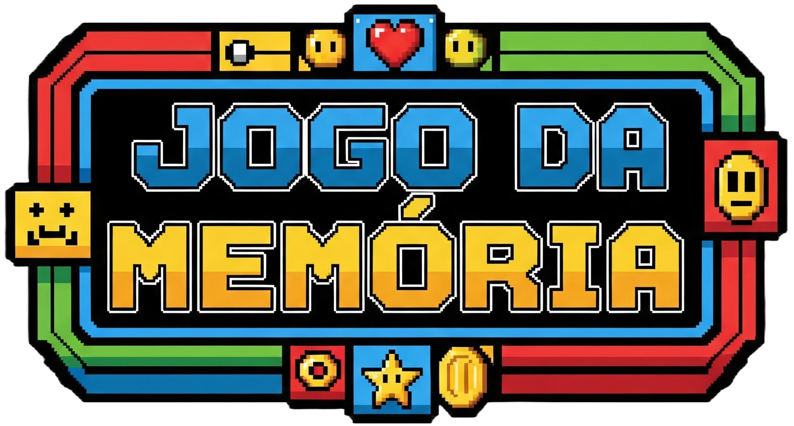

<div align="center">
  
</div><br>

Um pequeno projeto desenvolvido para testar e aprimorar suas habilidades de memorização de uma forma divertida e interativa. Este jogo contém figuras mundialmente conhecidas; foi desenvolvido utilizando o básico das tecnologias web fundamentais: HTML, CSS e JavaScript puro.<br>
Ainda há alguns elementos a serem implementados e pequenas correções e melhorias a serem feitas.<br><br>

ℹ️ <strong>Manual</strong>

O objetivo do jogo é óbvio: Encontre todos os pares de cartas idênticas no menor número de tentativas possível.

Início do Jogo: Ao carregar a página, você verá um tabuleiro com 20 cartas viradas para baixo.

Revelando as Cartas: Clique em uma carta para revelá-la. Em seguida, clique em uma segunda carta para tentar encontrar o seu par.

Encontrando um Par: Se as duas cartas forem idênticas, elas permanecerão visíveis e serão removidas do jogo. Parabéns, você acertou um par!

Se as cartas forem diferentes, elas serão viradas novamente para baixo após um breve instante. Você perderá um ponto de vida a cada erro.

Vidas: Você começa o jogo com um número limitado de vidas. O jogo termina se suas vidas chegarem a zero.

Condições de Vitória: Você vence o jogo ao encontrar todos os 10 pares de cartas. Uma mensagem de "You Win!" será exibida.

Fim de Jogo: Se suas vidas se esgotarem, o jogo termina e uma mensagem de "Game Over" aparecerá, com a opção de reiniciar a partida.

✨ <strong>Funcionalidades</strong>

O jogo conta com diversas funcionalidades para melhorar a experiência do usuário:

Sistema de Vidas: A cada erro, uma vida é deduzida, adicionando um elemento de desafio ao jogo.

Menu Lateral customizável: Um menu lateral interativo permite acessar as configurações do jogo.

Temas Visuais: Personalize sua experiência de jogo escolhendo entre os temas "Dia" (☀️) e "Noite" (🌙). A seleção altera o plano de fundo, o estilo das cartas e outros elementos visuais.

Níveis de Dificuldade: Ajuste o desafio do jogo selecionando um dos três níveis de dificuldade, que alteram o número inicial de vidas.

<em>Fácil: 10 vidas

Médio: 8 vidas

Difícil: 6 vidas</em>

Animações e Efeitos Visuais: O jogo é enriquecido com diversas animações, como o giro das cartas, efeitos de brilho ao passar o mouse e transições suaves, tornando a jogabilidade mais fluida e agradável.

Design Responsivo: A interface se adapta a diferentes tamanhos de tela, garantindo uma boa experiência tanto em desktops quanto em dispositivos móveis.

🛠️ <strong>Tecnologias Utilizadas</strong>

Este projeto foi construído do zero, utilizando a base do desenvolvimento web:

HTML5: Para a estruturação semântica do conteúdo do jogo.

CSS3: Para a estilização, layout, animações e a criação dos temas visuais.

JavaScript (ES6+): Responsável por toda a lógica do jogo, incluindo o embaralhamento de cartas, a mecânica de pares, o gerenciamento de vidas, a manipulação de eventos e a interatividade do menu.<br>

📁 <strong>Estrutura do Projeto</strong>
```
├── _assets/
│ ├── _images/
│ ├── _sounds/
│ └── _fonts/
│
├── _styles/
│ ├── main.css      
│ └── responsiveness.css 
│
└── _scripts/
    ├── _modules/
    │   ├── Sky.js # Classe dedicada para a animação de céu estrelado
    │   └── resources.js
    │
    └── main.js

├── main.html
```
⌨️ <strong>Como Executar o Projeto</strong>

Para executar o jogo, basta clonar este repositório e abrir o arquivo main.html em seu navegador de preferência.

`git clone https://github.com/seu-usuario/seu-repositorio.git
cd seu-repositorio` # Abra o arquivo main.html no navegador
